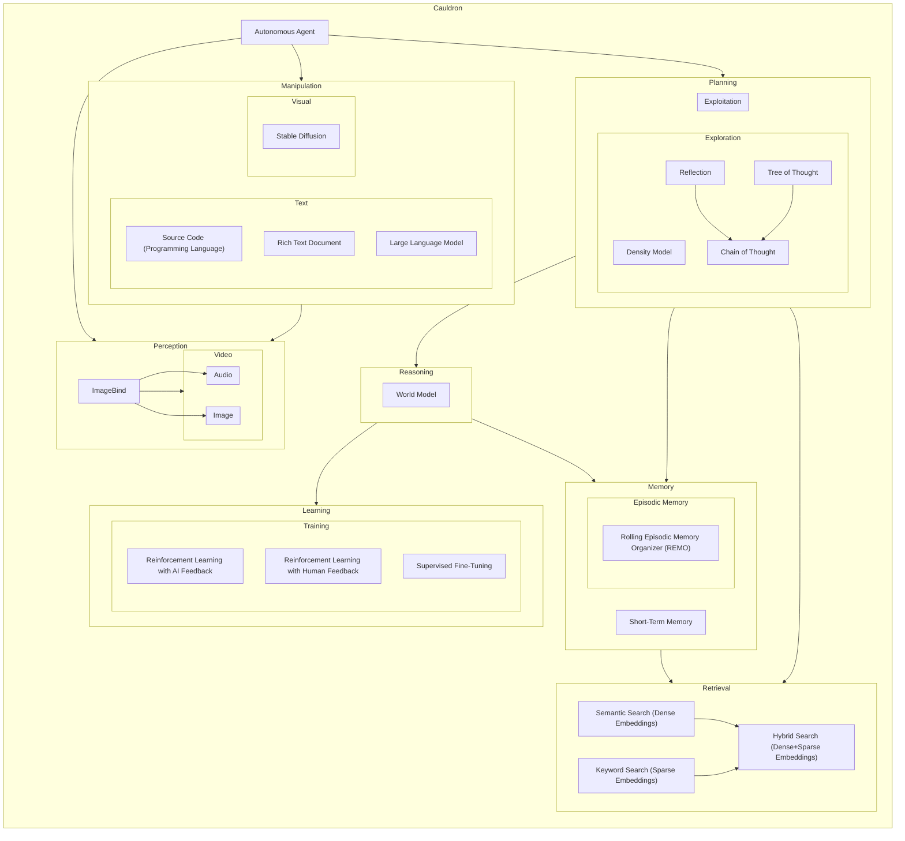

# Cauldron

> Engine of Evolution: Transforming Ideas into Reality  

```mermaid
flowchart TB
subgraph Cauldron
direction TB

Agent[Autonomous Agent]
Agent-->Perception & Manipulation & Planning

subgraph Perception
  ImageBind
  
  ImageBind-->Video & Image & Audio
  subgraph Video
    subgraph Image
    end
    subgraph Audio
    end
  end
end

Manipulation-->Perception
subgraph Manipulation
  subgraph Text
    Code["Source Code (Programming Language)"]
    RichDoc[Rich Text Document]
    LLM[Large Language Model]
  end
  subgraph Visual
    SD[Stable Diffusion]
  end
end

Reasoning-->Learning
subgraph Learning
  subgraph Training
    RLAIF[Reinforcement Learning with AI Feedback]
    RLHF[Reinforcement Learning with Human Feedback]
    SFT[Supervised Fine-Tuning]
  end
end

subgraph Planning
  subgraph Exploration
    Density[Density Model]
    ToT[Tree of Thought]
    Reflection
    Reflection & ToT-->CoT
    CoT[Chain of Thought]
  end

  subgraph Exploitation

  end
end

Planning-->Reasoning
subgraph Reasoning
  WorldModel[World Model]
end

Reasoning & Planning-->Memory
subgraph Memory
  subgraph Episodic[Episodic Memory]
    REMO["Rolling Episodic Memory Organizer (REMO)"]
    click REMO href "https://github.com/daveshap/REMO_Framework" _blank
  end
  ShortTerm[Short-Term Memory]
  
end

Memory & Planning-->Retrieval
subgraph Retrieval
  Hybrid["Hybrid Search (Dense+Sparse Embeddings)"]
  Semantic & Keyword --> Hybrid
  Semantic["Semantic Search (Dense Embeddings)"]
  Keyword["Keyword Search (Sparse Embeddings)"]
end

end
```
